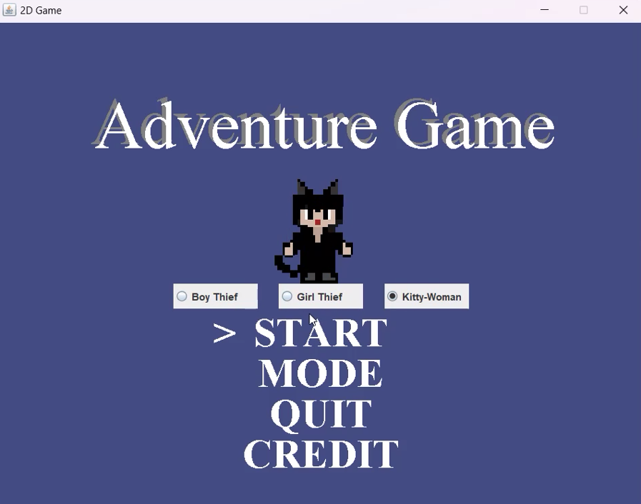
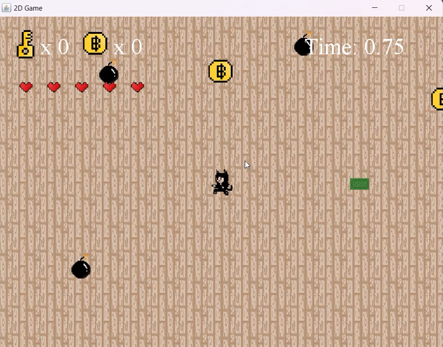
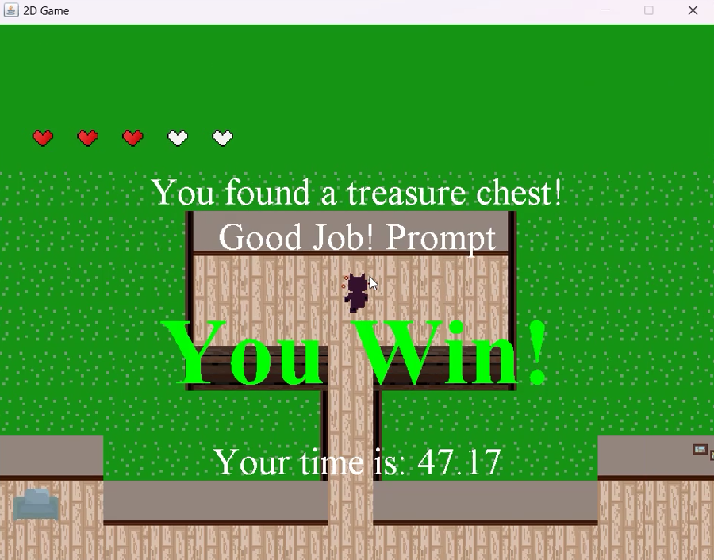

# Java Game Project

A Java-based game project built using standard Java tools and libraries.  
This project demonstrates core game logic, rendering, input handling, and game loop concepts in Java.

---

## 🎮 Overview

This Java Game Project is a standalone game built in pure Java (no external game engine). It handles:

- Window creation & rendering loop  
- Keyboard / mouse input  
- Game state updates & collision detection  
- Rendering graphics (2D sprites, shapes, text)  
- Game scenes or levels  

---

## 📁 Project Structure
```
Java-Game-Project/
├── src/
│ └── main/
│ └── java/
├── target/ # compiled classes & build artifacts
└── pom.xml # Maven config (or your build tool file)
```

---

## 🛠️ Tech Stack & Dependencies

This project uses:

- **Java (JDK 8 or higher)** — core programming language  
- **Maven** — build tool & dependency management  
- **Java AWT / Swing / Java2D** — for windowing, rendering and input (depending on implementation)

---

## 🎯 Gameplay / Controls

- Use **WASD** to move
- Collision: players/enemies/obstacles  
- Game over / win conditions

---

## 📄 How to play

- Collect **coin/bill/diamond/gold/etc.**
- Use it to open the **door**
- Get a **key** in the room
- Use a key to open the **chest**
- You win!

**Becareful don't hit bomb/fire/handcuff/etc.**
**And run away from NPC(Boy with a red hat)**

---

## 🧭 Gameplay Screenshot





